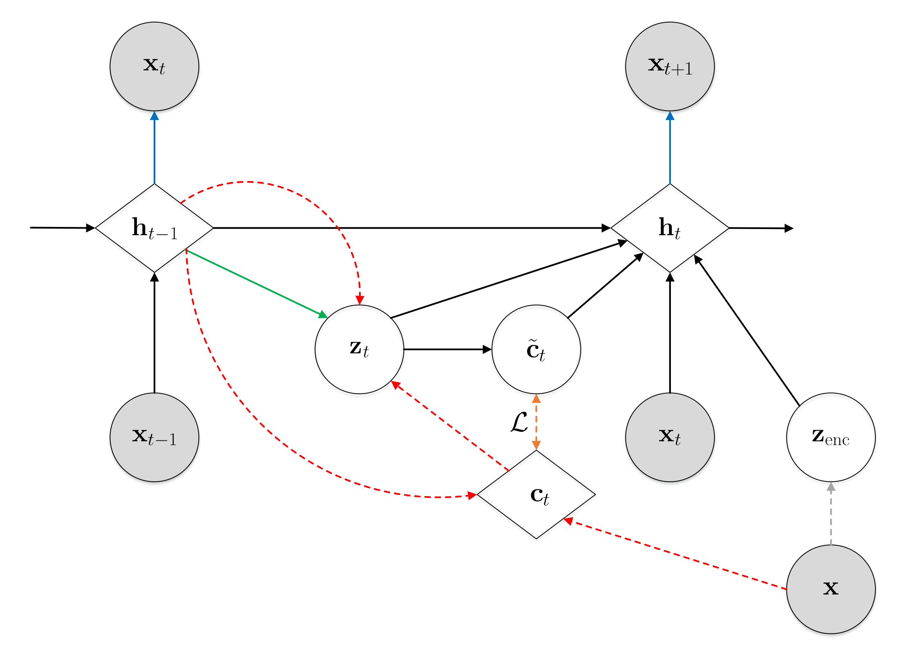
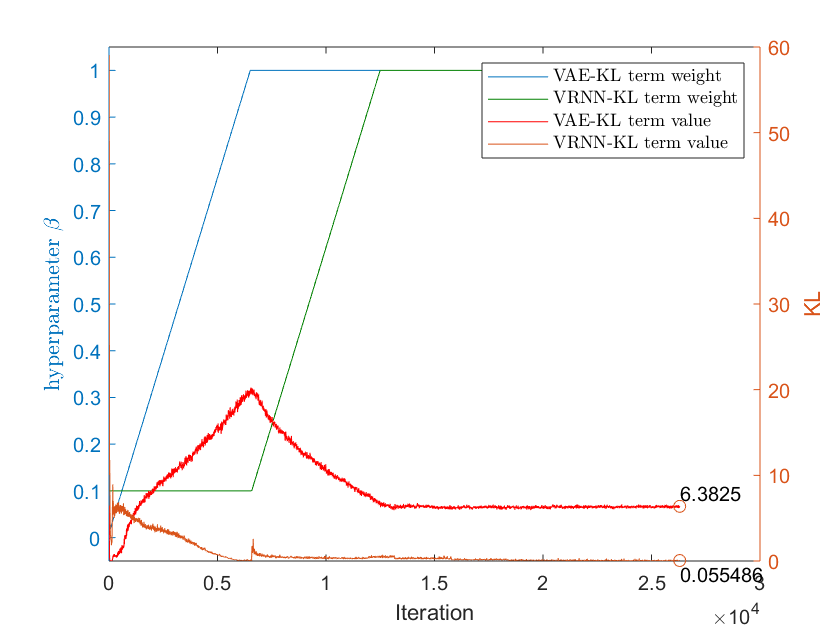
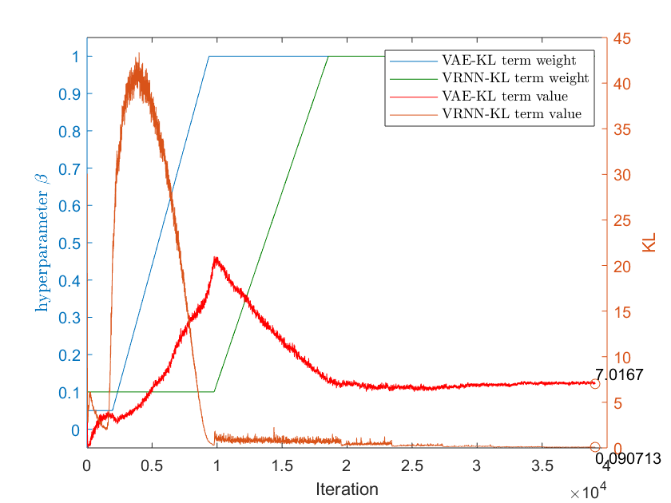
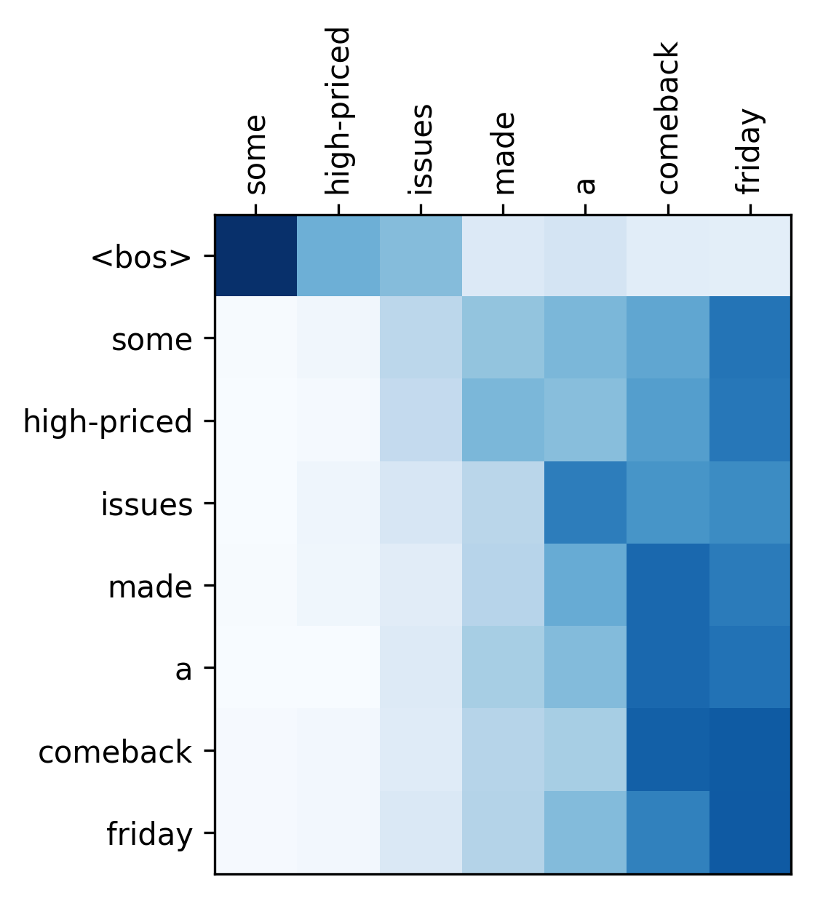
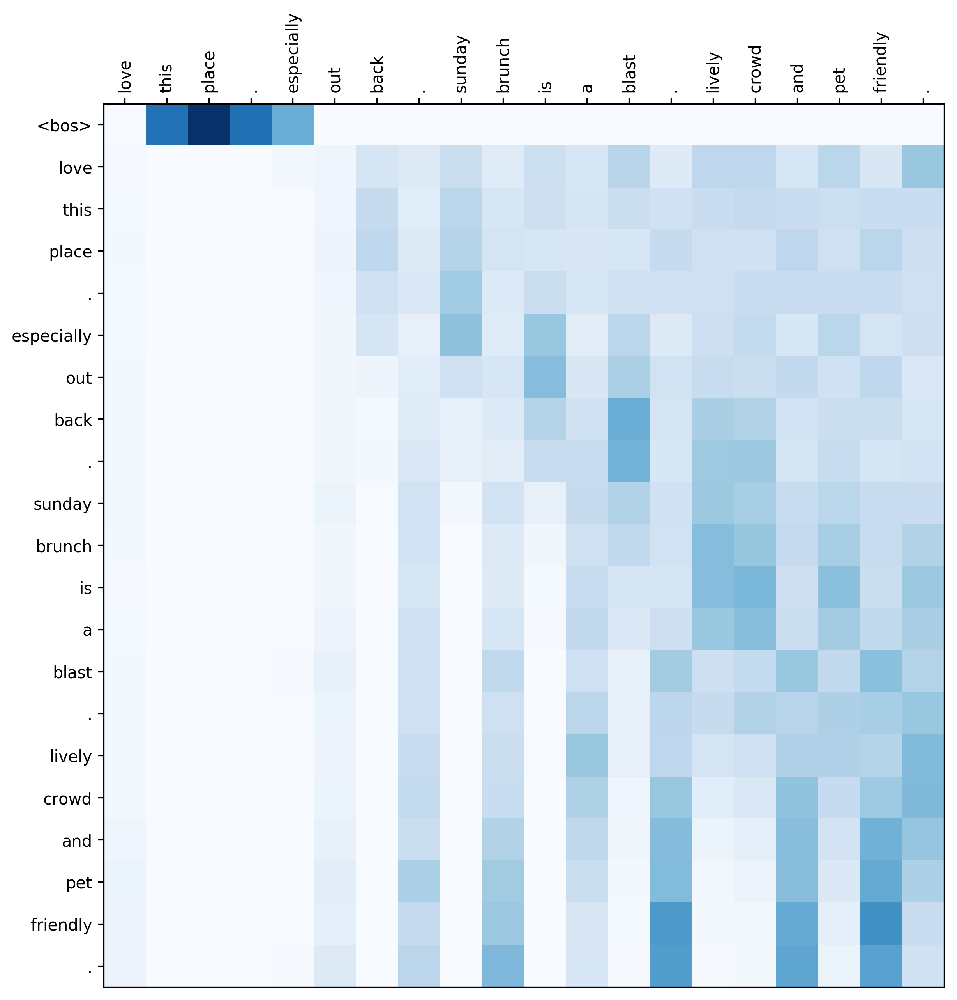

# Self-Attention Model for Sequence Generation
In this repository, we implement our proposed self-attention model based on VAE for sequence generation in the Penn TreeBank and Yelp 2013. The datasets are downloaded from [Tomas Mikolov's webpage](http://www.fit.vutbr.cz/~imikolov/rnnlm/) and [Jiacheng Xu's repository](https://github.com/jiacheng-xu/vmf_vae_nlp).

Traditionally, VAE in sequence generation consists of two RNNs for both encoder and decoder. However, applying attention mechanism to this encoder-decoder architecture is a challenge as we want to generate new sequences from the latent space where the encoder is disregarded. To address this problem, this model uses a stochastic RNN as the decoder of VAE which of additional latent variables allow us to reconstruct the context vector to compensate the missing of the attention information in the generative process.

  

## Setting
- Framework:
    - Pytorch 0.4.0
- Hardware:
	- CPU: Intel Core i7-5820K @3.30 GHz
	- RAM: 64 GB DDR4-2400
	- GPU: GeForce GTX 1080ti

## Result of learning curve
|  |
| :------------------------------------------------: |
| Penn TreeBank                                      |

|  |
| :--------------------------------------------------: |
| Yelp 2013                                            |

## Attention visualization
|  |
| :-----------------------------------------: |
| Penn TreeBank                               |

|  |
| :------------------------------------------: |
| Yelp 2013                                    |
